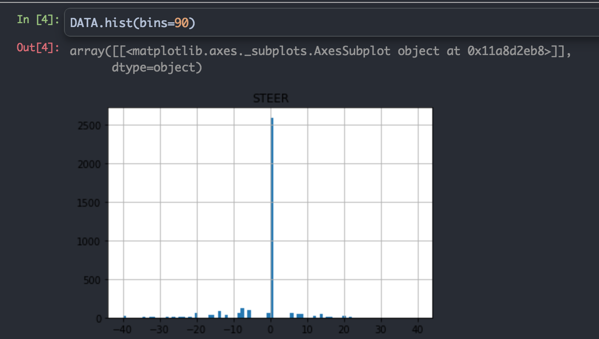
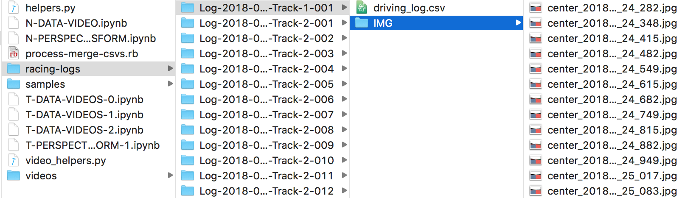
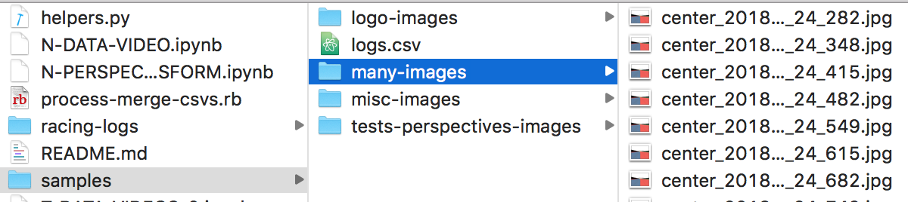
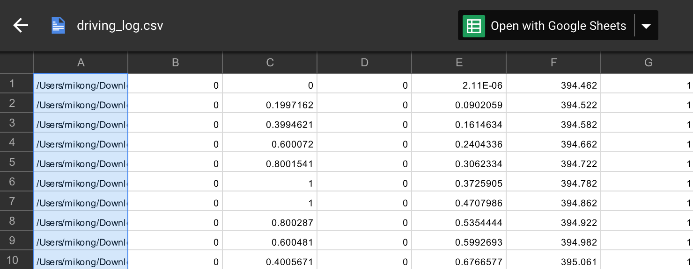
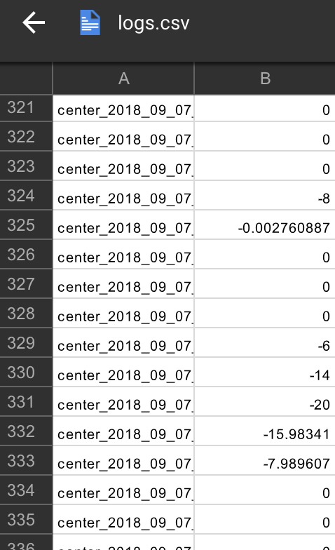

# Contents
- NOTES
- Unify datasets
- Setup
- Preprocess and Analyze your Data
- Train your Model
- Drive your Model

# NOTES
- Can be driven on application version `formula-trend-1.0.0-alpha.4`

- To run the notebooks in the `./other-notebooks/` directory, you must move them to the root directory.
If you don't they will not find the files they're looking for. These notebooks are essentially just a playground for me. I removed it from the root directory to reduce clutter but I decided not to delete them because it maybe helpful to you.

# Version 0.1A `model.h5`
- Model `./misc/model.h5` does not work on track 3 because because the data is ridiculously unbalanced. "bad" data must be removed, and more "good" data should be acquired. Data augmentation techniques should also be used.
- Only `3613` images are used
- Check the `videos` directory `track1-480p.mp4` and `track2-480p.mp4` for current performance.
- See also `x-many-images-unified.mp4` for a stitch of all data used and preprocessing done (IE cropping and perspective transform)
- Works with the following configurations
``
THROTTLE_MAX = 0.7
C_SPEED = 1.1
C_STEER = 10.0
throttle = THROTTLE_MAX - C_SPEED * (speed / MAX_SPEED)**2 - C_STEER * (steering_angle / MAX_ANGLE)**2
throttle = max(0.0, throttle)
```



# VERSION 0.1B `failedmodel2.h5`
- Use `23365` data points
- performed worse. But could recover though. The driver was probably really bad.
- To run notebooks used to make this version of the model, move the notebooks
from the `failed-v2` directory, to the root `./A-AV1` directory before running
so it can see all the required files
- the images used can be downloaded here.
```
https://drive.google.com/drive/folders/17RZNdC2KSgNNnV65gxcJXzkZYxqFi670?usp=sharing
```


# SETUP
- Install [Anaconda](https://www.continuum.io/downloads) or [Miniconda](https://conda.io/miniconda.html)

- Create environment

```
# Use TensorFlow without GPU
$ conda env create -f ./misc/environments.yml

# Use TensorFlow with GPU
$ conda env create -f ./misc/environment-gpu.yml
```

- Activate environment and run Jupyter

```
$ source activate trendy
$ Jupyter notebook
```


# Unify Datasets

### You may have a lot and you may have a directory structure that looks like the image


---

### And you may want to unify them so that they're easier to feed to your neural network


---

### You use the following command on your terminal to copy all the images from the subdirectories in a directory A to directory B, so things get flat.
```
find ./racing-logs/ -name '*.jpg' -exec cp '{}' ./samples/many-images/ \;
```

---

### Given that your dataset directory is now flat, you probably want to merge all your logs. You probably also just want the file names of your data as opposed to the absolute path to your images, and you probably just need the image file name (first row), and the steering angles (second row).

| BEFORE | AFTER      |
| ----------------------------- |:-------------------------------:|
|  ||

---

### Inspect and run the Ruby script to do this and simplify your life
- Inspect `./misc/process-merge-csvs.rb` and change the following file paths
```
# Parent directory where CSVs are stored
PARENT_DIR="./racing-logs/"

# Full path to the output CSV file
OUTPUT_FILE="./samples/logs.csv"
```
- Run the script
```
$ ruby ./misc/process-merge-csvs.rb
```
- Add `NAME,STEER` at the start of your csv file

# Preprocess and Analyze your Data
- Inspect `A-PERSPECTIVE-TRANSFORM.ipynb`
- Inspect `A-DATA-VIDEO.ipynb`
- Inspect `A-PANDAS.ipynb`
- Inspect helper functions such as `helpers.py` and `video_helpers.py`

# Train your Model
- Run `A-MODEL-SAMPLE.ipynb`

# Drive your Model
- Run your app `formula-trend-1.0.0-alpha.4`
- Inspect and Run `python drive.py ./misc/model.h5`
