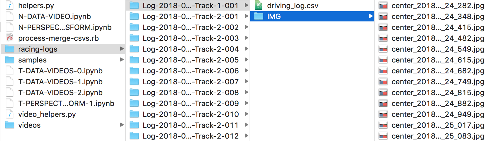
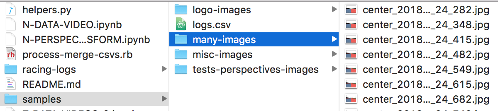
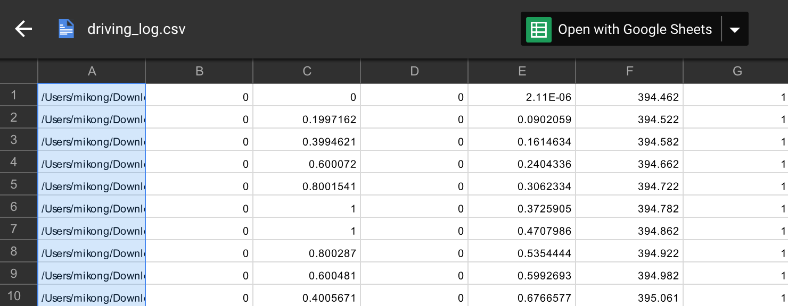
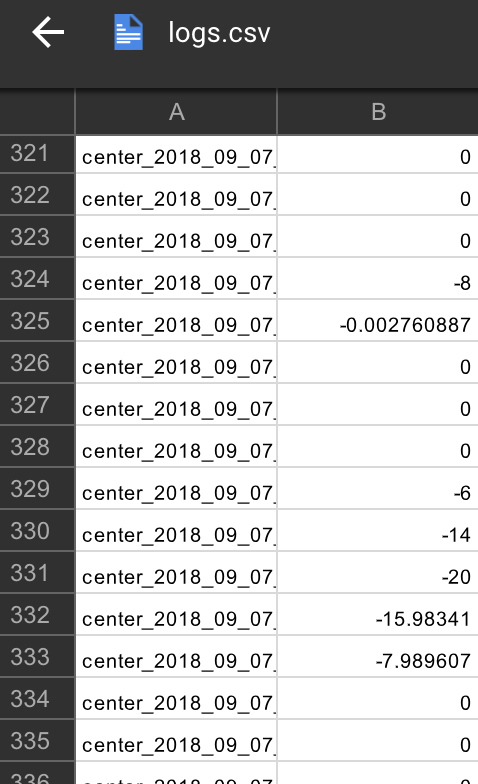

# WIP Contents
- [DONE] NOTES
- [DONE] Unify datasets
- [DONE] Setup
- [DONE] Preprocess and Analyze your Data
- [DONE] Train your Model
- [DONE] Drive your Model
- MORE SECTIONS IN THE FUTURE

# NOTES
- Check the `videos` directory `track1.mov` and `track2.mov` for current performance.
- See also `many-images-unified.mp4` for a stitch of all data used
- Model does not work on track 3 because because the data is ridiculously unbalanced. "bad" data must be removed, and more "good" data should be acquired. Data augmentation techniques should also be used.
- To run the notebooks in the `./other-notebooks/` directory, you must move them to the root directory.
If you don't it will not find the files its looking for. These notebooks are essentially just a playground for me. I removed it from the root directory to reduce clutter but it maybe helpful to you.

# SETUP
- Install [anaconda](https://www.continuum.io/downloads) or [miniconda](https://conda.io/miniconda.html)

- Create environment

```python
# Use TensorFlow without GPU
$ conda env create -f ./misc/environments.yml

# Use TensorFlow with GPU
$ conda env create -f ./misc/environment-gpu.yml
```

- Activate environment and run Jupyter

```
$ source activate trendy
$ Jupyter notebook
```


# Unify Datasets
- You may have a lot and you may have a directory structure that looks like the image

- And you may want to unify them so that they're easier to feed to your neural network

- You use the following command on your terminal to copy all the images from the subdirectories in a
directory A to directory B, so things get flat.
```
find ./racing-logs/ -name '*.jpg' -exec cp '{}' ./samples/many-images/ \;
```
- You probably also just want the file names of your data as opposed to the absolute path to your images,
and you probably just need the image file name, and the steering angles (first row)

| BEFORE | AFTER      |
| ----------------------------- |:-------------------------------:|
|  ||

- Inspect and Run the ruby script
```
$ ruby ./misc/process-merge-csvs.rb
```

# Preprocess and Analyze your Data
- Inspect `A-PERSPECTIVE-TRANSFORM.ipynb`
- Inspect `A-DATA-VIDEO.ipynb`
- Inspect `A-PANDAS.ipynb`
- Inspect helper functions at `helpers.py` and `video_helpers.py`

# Train your Model
- Run `A-MODEL-SAMPLE.ipynb`

# Drive your Model
- Run your app
- Inspect and Run `python drive.py ./misc/model.py`

# MORE SECTIONS IN THE FUTURE
- Todo
